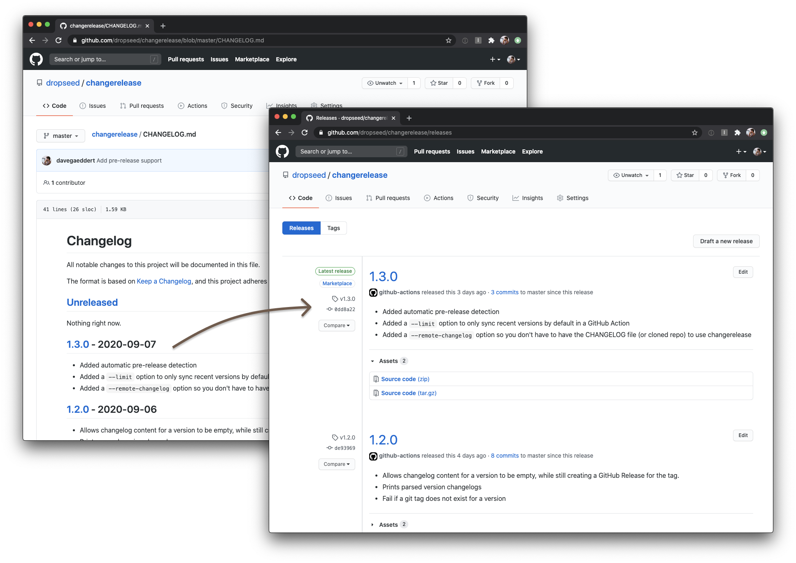

# changerelease

Automatically update your GitHub Releases from `CHANGELOG.md`.

This tool expects that you follow the [Keep a Changelog](https://keepachangelog.com/) format.

To use it:

1. [Keep a Changelog](https://keepachangelog.com/)
1. Git tag your versions
1. Let the changerelease GitHub Action automatically keep your GitHub Releases updated



## Use the GitHub Action

```yml
name: changerelease
on:
  workflow_dispatch: {}
  push:
    paths: [CHANGELOG.md]
    branches: [master]
    tags: ["*"]

jobs:
  sync:
    runs-on: ubuntu-latest
    steps:
    - uses: dropseed/changerelease@v1
      with:
        github_token: ${{ secrets.GITHUB_TOKEN }}
        # optional
        tag_prefix: v
        changelog: CHANGELOG.md
```

## What if my changelog isn't in Markdown?

For changelogs written in reStructuredText or another syntax besides Markdown,
you can run a conversion step before running changerelease.
This can be a custom rendering script or something like [pandoc](https://pandoc.org/) to convert your changelog to Markdown.
The only real expectation is that your version names are written in h2 headings (`## {version_name}`).

```yaml
name: changerelease
on:
  workflow_dispatch: {}
  push:
    paths: [CHANGELOG.md]
    branches: [master]
    tags: ["*"]

jobs:
  sync:
    runs-on: ubuntu-latest
    steps:
    - uses: actions/checkout@v2

    # Convert to markdown first
    # https://github.com/pandoc/pandoc-action-example
    - uses: docker://pandoc/core:2.14
      with:
        args: "CHANGELOG.rst -f rst -t markdown -o CR_CHANGELOG.md"

    - uses: dropseed/changerelease@v1
      with:
        github_token: ${{ secrets.GITHUB_TOKEN }}
        # optional
        tag_prefix: v
        changelog: CR_CHANGELOG.md
        remote_changelog: false
```
